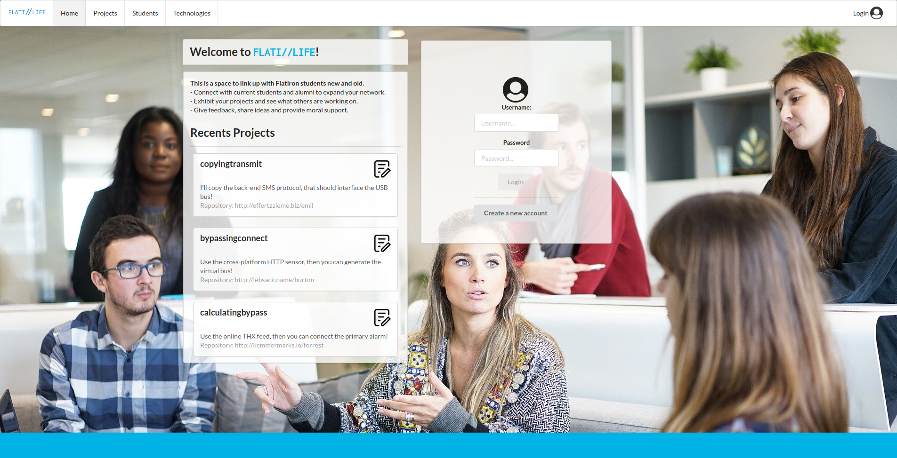
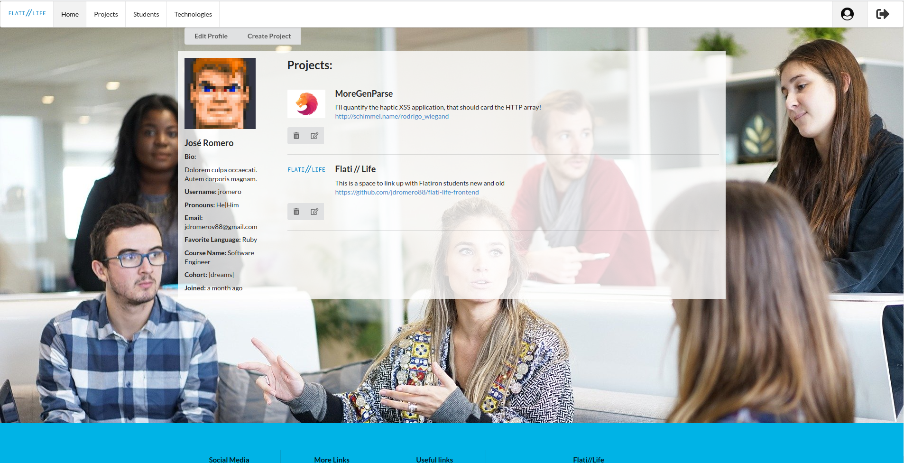
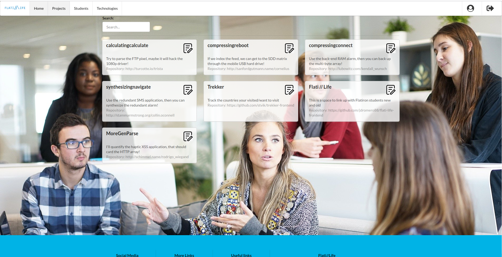
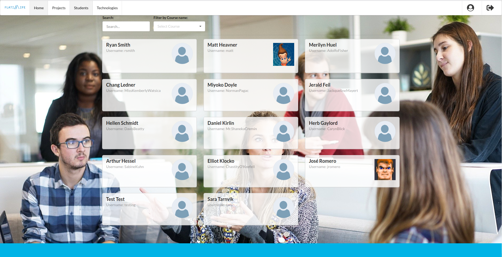
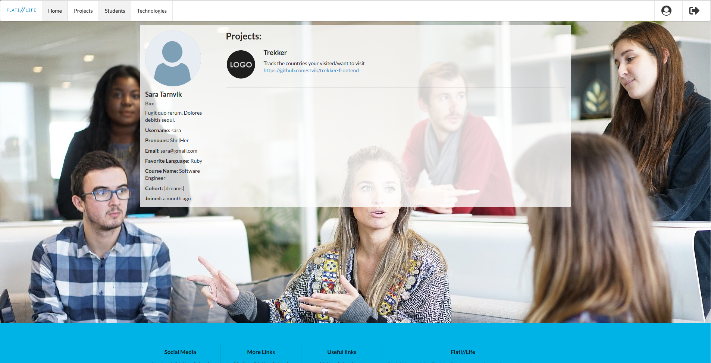

## FlatiLife Backend
This is a space to link up with Flatiron students new and old.
- Connect with current students and alumni to expand your network.
- Exhibit your projects and see what others are working on.
- Give feedback, share ideas and provide moral support.

## Developed with:
- Ruby on Rails with validations, strong params, authentication using Bcrypt ruby gem
- Used PostgreSQL for the database and developed RESTful API
- Javascript, ReactJS and Redux
- Semantic-UI framework and custom CSS

## To run this project
- Clone this repository
- Open a terminal & go to the directory and run the next commands:
  - bundle install
  - rails db:create
  - rails db:migrate
  - rails db:seed
  - run: rails s (Start the local server in your browser http://localhost:3000 )

- FlatiLife frontend link: https://github.com/jdromero88/flati-life-frontend

## Preview

